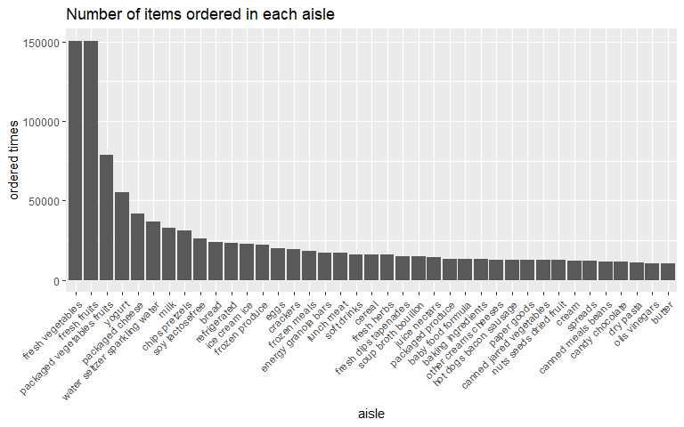
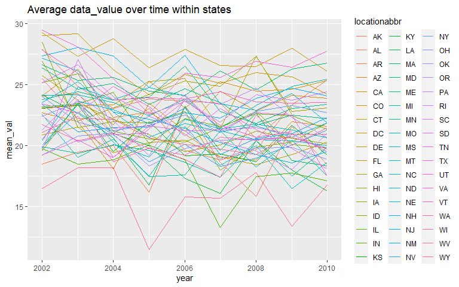
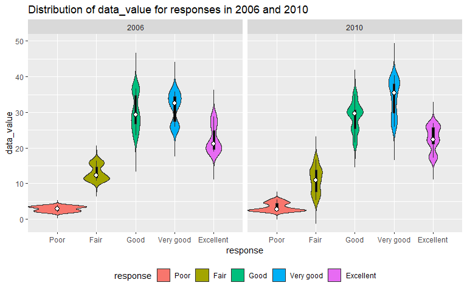
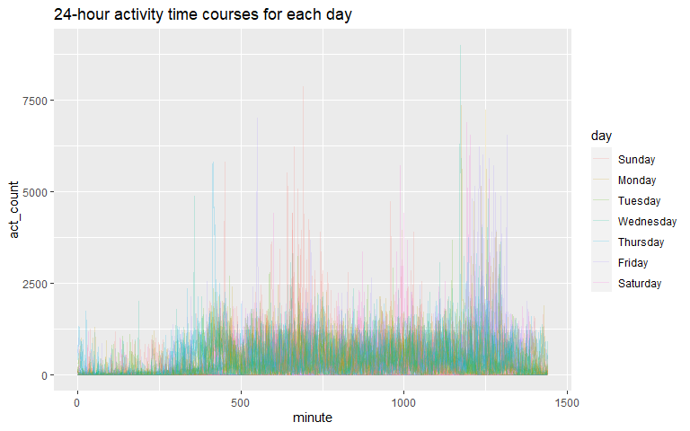
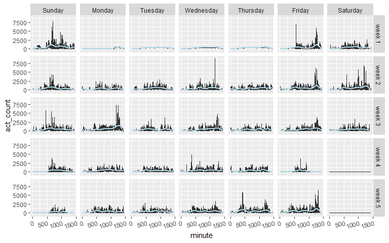

p8105_hw3_hz2771
================
Haolin Zhong (UNI: hz2771)
2021/10/12

``` r
library(tidyverse)
```

    ## -- Attaching packages --------------------------------------- tidyverse 1.3.1 --

    ## v ggplot2 3.3.5     v purrr   0.3.4
    ## v tibble  3.1.4     v dplyr   1.0.7
    ## v tidyr   1.1.3     v stringr 1.4.0
    ## v readr   2.0.1     v forcats 0.5.1

    ## -- Conflicts ------------------------------------------ tidyverse_conflicts() --
    ## x dplyr::filter() masks stats::filter()
    ## x dplyr::lag()    masks stats::lag()

``` r
library(ggplot2)
library(lubridate)
```

    ## 
    ## 载入程辑包：'lubridate'

    ## The following objects are masked from 'package:base':
    ## 
    ##     date, intersect, setdiff, union

``` r
library(p8105.datasets)
library(patchwork)
```

# Problem 1

## Load instacart data

``` r
data("instacart")
```

The instacart dataset contains 1384617 rows and 15 columns. This dataset
is a products transaction order table, with each row recording a order
of a product from a user, and columns representing transaction
information and product features.

-   columns including transaction information:
    -   `order_id`
    -   `product_id`
    -   `user_id`
    -   `add_to_cart_order`: the order in which the product was added
    -   `order_number`: the order sequence number for this user
        (1=first, n=nth)
    -   `order_dow`: the day of the week on which the order was placed
    -   `order_hour_of_day`: the hour of the day on which the order was
        placed
    -   `day_since_prior_order`: days since the last order, capped at
        30, NA if order_number=1
-   columns including product features:
    -   `product_name`: e.g. Bulgarian Yogurt, Bag of Organic Bananas
    -   `aisle_id`: aisle identifier
    -   `aisle`: name of the aisle, e.g. fresh vegetables, fresh fruit
    -   `department_id`: department identifier
    -   `department`: the name of the department, e.g. dairy eggs,
        produce, beverages
    -   `reordered`: 1 if this prodcut has been ordered by this user in
        the past, 0 otherwise

## How many aisles are there, and which aisles are the most items ordered from?

### Count aisle number

``` r
instacart %>% 
  summarize(n_aisles = n_distinct(aisle_id))
```

    ## # A tibble: 1 x 1
    ##   n_aisles
    ##      <int>
    ## 1      134

In total, there are 134 aisles.

### Most ordered aisles

``` r
instacart %>% 
  group_by(aisle) %>% 
  summarize(sold = n()) %>% 
  filter(sold == max(sold)) %>% 
  select(aisle)
```

    ## # A tibble: 1 x 1
    ##   aisle           
    ##   <chr>           
    ## 1 fresh vegetables

The aisle that the most items ordered from is `fresh vegetables`.

## Plot number of items ordered in each aisle

``` r
instacart %>% 
  group_by(aisle) %>% 
  summarize(n_sold = n()) %>% 
  filter(n_sold > 10000) %>% 
  ggplot(aes(x = reorder(aisle, -n_sold), y = n_sold)) +
  geom_col() + 
  scale_x_discrete(limits = ) +
  theme(axis.text.x = element_text(angle = 45, hjust = 1, vjust = 1)) +
  xlab("aisle") +
  ylab("ordered times") +
  labs(title = "Number of items ordered in each aisle")
```

<!-- -->

## Make a table showing the three most popular items in `baking ingredients`, `dog food care`, and `packaged vegetables fruits`

``` r
instacart %>% 
  filter(aisle %in% c("baking ingredients", "dog food care", "packaged vegetables fruits")) %>% 
  count(aisle, product_name, name = "n_item_sold") %>% 
  group_by(aisle) %>% 
  mutate(inner_rank = min_rank(desc(n_item_sold))) %>% 
  filter(inner_rank < 4) %>% 
  arrange(aisle, inner_rank) %>% 
  select(-inner_rank, most_popular_items = product_name) %>% 
  knitr::kable()
```

| aisle                      | most_popular_items                            | n_item_sold |
|:---------------------------|:----------------------------------------------|------------:|
| baking ingredients         | Light Brown Sugar                             |         499 |
| baking ingredients         | Pure Baking Soda                              |         387 |
| baking ingredients         | Cane Sugar                                    |         336 |
| dog food care              | Snack Sticks Chicken & Rice Recipe Dog Treats |          30 |
| dog food care              | Organix Chicken & Brown Rice Recipe           |          28 |
| dog food care              | Small Dog Biscuits                            |          26 |
| packaged vegetables fruits | Organic Baby Spinach                          |        9784 |
| packaged vegetables fruits | Organic Raspberries                           |        5546 |
| packaged vegetables fruits | Organic Blueberries                           |        4966 |

## Make a table showing the mean hour of the day at which `Pink Lady Apples` and `Coffee Ice Cream` are ordered on each day of the week

``` r
instacart %>% 
  filter(product_name %in% c("Pink Lady Apples", "Coffee Ice Cream")) %>% 
  group_by(product_name, order_dow) %>% 
  summarize(mean_hour_ordered = round(mean(order_hour_of_day),2)) %>% 
  mutate(order_dow = recode(order_dow,
                            `0` = "Sun",
                            `1` = "Mon",
                            `2` = "Tue",
                            `3` = "Wed",
                            `4` = "Thr",
                            `5` = "Fri",
                            `6` = "Sat")
         ) %>% 
  pivot_wider(names_from = order_dow, values_from = mean_hour_ordered) %>% 
  knitr::kable()
```

| product_name     |   Sun |   Mon |   Tue |   Wed |   Thr |   Fri |   Sat |
|:-----------------|------:|------:|------:|------:|------:|------:|------:|
| Coffee Ice Cream | 13.77 | 14.32 | 15.38 | 15.32 | 15.22 | 12.26 | 13.83 |
| Pink Lady Apples | 13.44 | 11.36 | 11.70 | 14.25 | 11.55 | 12.78 | 11.94 |

# Problem 2

## Load data

``` r
data("brfss_smart2010")
```

## Data cleaning

``` r
brfss_df = brfss_smart2010 %>% 
  janitor::clean_names() %>% 
  filter(topic == "Overall Health") %>% 
  filter(response %in% c("Excellent", "Very good", "Good", "Fair", "Poor")) %>% 
  mutate(response = 
           fct_relevel(response, 
                  levels = c("Poor", "Fair", "Good", "Very good", "Excellent")))
```

## In 2002, which states were observed at 7 or more locations? What about in 2010?

### 2002

``` r
brfss_df %>% 
  filter(year == 2002) %>% 
  group_by(locationabbr, locationdesc) %>% 
  summarize() %>% 
  count(locationabbr, name = "n_obs") %>% 
  filter(n_obs >= 7) %>% 
  select(locationabbr) %>% 
  knitr::kable()
```

    ## `summarise()` has grouped output by 'locationabbr'. You can override using the `.groups` argument.

| locationabbr |
|:-------------|
| CT           |
| FL           |
| MA           |
| NC           |
| NJ           |
| PA           |

In 2002, the above states were observed at 7 or more locations.

### 2010

``` r
brfss_df %>% 
  filter(year == 2010) %>% 
  group_by(locationabbr, locationdesc) %>% 
  summarize() %>% 
  count(locationabbr, name = "n_obs") %>% 
  filter(n_obs >= 7) %>% 
  select(locationabbr) %>% 
  knitr::kable()
```

    ## `summarise()` has grouped output by 'locationabbr'. You can override using the `.groups` argument.

| locationabbr |
|:-------------|
| CA           |
| CO           |
| FL           |
| MA           |
| MD           |
| NC           |
| NE           |
| NJ           |
| NY           |
| OH           |
| PA           |
| SC           |
| TX           |
| WA           |

In 2010, the above states were observed at 7 or more locations.

## Make a “spaghetti” plot of average `data_value` over time within a state

``` r
brfss_df %>% 
  filter(response == "Excellent") %>% 
  group_by(year, locationabbr) %>% 
  summarize(mean_val = mean(data_value)) %>% 
  ggplot(aes(x = year, y = mean_val, group = locationabbr, color = locationabbr)) +
  geom_line() +
  theme(legend.position = "right") + 
  labs(title = "Average data_value over time within states")
```

<!-- -->

## Make a two-panel plot showing distribution of data_value for responses in 2006 and 2010

``` r
brfss_df %>% 
  filter(locationabbr == "NY") %>%
  filter(year %in% c(2006, 2010)) %>% 
  ggplot(aes(x = response, y = data_value, fill = response)) +
  geom_violin(adjust = .6, width = 1.5, trim = FALSE) +
  geom_boxplot(width = .05, fill = "black", outlier.colour = NA) +
  stat_summary(fun.y = median, geom = "point", fill = "white", shape = 21, size = 2.5) +
  facet_grid(~year) +
  theme(legend.position = "bottom") +
  labs(title = "Distribution of data_value for responses in 2006 and 2010")
```

<!-- -->

# Problem 3

## Load, tidy, and otherwise wrangle the data

``` r
aclrm_data_path = "./data/accel_data.csv"
aclrm_df = read_csv(aclrm_data_path) %>% 
  janitor::clean_names() %>% 
  pivot_longer("activity_1":"activity_1440", 
               names_to = "minute", 
               values_to = "act_count", 
               names_prefix = "activity_") %>% 
  mutate(minute = as.integer(minute),
         day = factor(day),
         day = fct_relevel(day, "Sunday", "Monday", "Tuesday", "Wednesday", 
                           "Thursday", "Friday", "Saturday"),
         is_weekend = ifelse(day %in% c("Saturday", "Sunday"), 1, 0))
```

    ## Rows: 35 Columns: 1443

    ## -- Column specification --------------------------------------------------------
    ## Delimiter: ","
    ## chr    (1): day
    ## dbl (1442): week, day_id, activity.1, activity.2, activity.3, activity.4, ac...

    ## 
    ## i Use `spec()` to retrieve the full column specification for this data.
    ## i Specify the column types or set `show_col_types = FALSE` to quiet this message.

This dataset contains 50400 observations and 6 columns. Variables in
this dataset are:

-   `week`: the week number of this week, from 1 to 5
-   `day_id`: the day number of this day, from 1 to 35  
-   `day`: suggest which day of week this day is
-   `minute`: the minute number of this minute, from 1 to 1440
-   `act_count`: the total activity number in this minute
-   `is_weekend`: 1 for weekend, 0 for weekday

## Make a table showing total activity for each day

``` r
aclrm_df %>% 
  group_by(day, week) %>% 
  summarize(daily_act_count = sum(act_count)) %>% 
  pivot_wider(names_from = day, values_from = daily_act_count) %>% 
  knitr::kable()
```

    ## `summarise()` has grouped output by 'day'. You can override using the `.groups` argument.

| week | Sunday |    Monday |  Tuesday | Wednesday | Thursday |   Friday | Saturday |
|-----:|-------:|----------:|---------:|----------:|---------:|---------:|---------:|
|    1 | 631105 |  78828.07 | 307094.2 |    340115 | 355923.6 | 480542.6 |   376254 |
|    2 | 422018 | 295431.00 | 423245.0 |    440962 | 474048.0 | 568839.0 |   607175 |
|    3 | 467052 | 685910.00 | 381507.0 |    468869 | 371230.0 | 467420.0 |   382928 |
|    4 | 260617 | 409450.00 | 319568.0 |    434460 | 340291.0 | 154049.0 |     1440 |
|    5 | 138421 | 389080.00 | 367824.0 |    445366 | 549658.0 | 620860.0 |     1440 |

In the Saturday of week 4 and 5, we can observe unreasonably low
activity count. In the raw data every minute in these 2 days only have 1
activity, suggesting possible mistakes in collecting the data.

## Plot the 24-hour activity time courses for each day

``` r
aclrm_df %>% 
  ggplot(aes(x = minute, y = act_count, color = day, group = day_id)) +
  geom_line(alpha = 0.2) +
  labs(title = "24-hour activity time courses for each day")
```

<!-- -->

This plot is kind of messy. For observing the trends, we can make
another plot with facet:

``` r
aclrm_df %>% 
  mutate(week = recode(week,
                       `1` = "week 1",
                       `2` = "week 2",
                       `3` = "week 3",
                       `4` = "week 4",
                       `5` = "week 5")) %>% 
  ggplot(aes(x = minute, y = act_count)) +
  geom_line(alpha = 0.8) +
  geom_smooth(color = "lightblue") +
  theme(axis.text.x = element_text(angle = 15, hjust = 1, vjust = 1)) +
  facet_grid(week ~ day)
```

    ## `geom_smooth()` using method = 'gam' and formula 'y ~ s(x, bs = "cs")'

<!-- -->

By this plot we can observe obvious activity peaks at Friday evenings
and Sunday Mornings.
